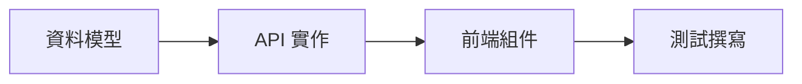

# /dev-plan <task_number> - 規劃任務清單

針對指定的 spec 進行深度分析，產生符合 dev-workflow 規範的任務清單。

## 參數

- `task_number`（必填）：任務編號，如 `001`、`002`

## 執行流程

### 階段一：讀取與理解 Spec

1. **讀取規格文件**
   ```
   .dev/specs/spec_{task_number}.md
   ```
   - 若不存在，提示使用者先建立 spec

2. **讀取架構文件**
   ```
   ARCHITECTURE.md
   ```
   - 了解現有專案架構、模組依賴、資料流
   - 若不存在，提示執行 `/dev-init`

3. **掃描相關程式碼**
   - 根據 spec 提到的模組，讀取相關檔案
   - 了解現有實作方式與程式碼風格

### 階段二：需求釐清（互動問答）

在分析過程中，若遇到以下情況，**必須**向使用者提問釐清：

#### 需要釐清的情境

1. **模糊的需求**
   - spec 描述不夠具體
   - 有多種可能的解讀方式

   範例提問：
   ```
   ❓ spec 中提到「使用者驗證」，請問：
   1. 驗證方式為何？（JWT / Session / OAuth）
   2. 需要支援哪些登入方式？（帳密 / Google / GitHub）
   3. Token 過期時間設定？
   ```

2. **技術選型**
   - 有多種可行的實作方式
   - 需要權衡 trade-offs

   範例提問：
   ```
   ❓ 關於資料快取策略，有以下選項：
   1. Redis（推薦）- 分散式快取，適合多節點部署
   2. 記憶體快取 - 簡單但重啟會遺失
   3. 檔案快取 - 持久化但效能較低

   請問偏好哪種方式？
   ```

3. **架構衝突**
   - spec 需求與現有架構可能衝突
   - 需要確認是否修改現有架構

   範例提問：
   ```
   ⚠️ 發現潛在架構衝突：

   spec 需求：新增 WebSocket 即時通訊
   現有架構：純 REST API 設計

   建議方案：
   1. 新增獨立 WebSocket 服務
   2. 整合至現有 API 服務

   請問偏好哪種方式？這會影響 ARCHITECTURE.md 的更新。
   ```

4. **邊界條件**
   - 驗收標準不明確
   - 錯誤處理方式未定義

   範例提問：
   ```
   ❓ 關於錯誤處理，spec 未明確定義：
   1. API 錯誤回應格式？
   2. 失敗重試機制？
   3. 使用者提示訊息？
   ```

5. **相依性問題**
   - 需要先完成其他功能
   - 需要額外的套件或服務

   範例提問：
   ```
   ❓ 此功能依賴以下項目，請確認狀態：
   1. spec_002 使用者系統 - 是否已完成？
   2. Redis 服務 - 是否已部署？
   3. 第三方 API 金鑰 - 是否已取得？
   ```

### 階段三：分解任務

完成需求釐清後，依照以下結構分解任務：

1. **識別修改範圍**
   - 列出需要修改的現有檔案
   - 列出需要新增的檔案
   - 標註每個檔案的修改類型（新增/修改/刪除）

2. **定義 API/組件接口**
   - 後端 API 端點設計
   - 前端組件設計
   - 資料模型設計

3. **規劃測試案例**
   - 單元測試
   - 整合測試
   - E2E 測試（如需要）

4. **排列任務順序**
   - 依據相依性排序
   - 標註可平行執行的任務

### 階段四：產生任務清單

建立 `.dev/specs/spec_{task_number}_task.md`：

```markdown
# spec_{task_number}_task: {功能名稱}

> 對應規格：`spec_{task_number}.md`
> 規劃日期：{current_date}
> 分支：`feat/{task_number}-{short_desc}`

## 需求釐清記錄

| 問題 | 決議 |
|------|------|
| [問題1] | [使用者回答] |
| [問題2] | [使用者回答] |

## 修改檔案清單

### 新增檔案
- [ ] `src/xxx/newFile.ts` - [描述]

### 修改檔案
- [ ] `src/xxx/existingFile.ts` - [修改內容]

## API/組件接口

### 後端 API
- [ ] `POST /api/v1/xxx` - [描述]
  - Request: `{ field: type }`
  - Response: `{ field: type }`

### 前端組件
- [ ] `<ComponentName />` - [描述]
  - Props: `{ prop: type }`

### 資料模型
- [ ] `interface XXX` - [描述]

## 測試案例

### 單元測試
- [ ] `xxx.test.ts` - [測試描述]

### 整合測試
- [ ] `xxx.integration.test.ts` - [測試描述]

## 任務相依性



## 預估工時

| 項目 | 預估時間 |
|------|----------|
| 後端開發 | X 小時 |
| 前端開發 | X 小時 |
| 測試撰寫 | X 小時 |
| 總計 | X 小時 |
```

### 階段五：確認與輸出

1. **摘要輸出**
   ```
   ✅ spec_{task_number} 任務規劃完成！

   📋 任務清單：.dev/specs/spec_{task_number}_task.md
   📊 任務數量：X 項
   ⏱️ 預估工時：X 小時

   任務摘要：
   - 新增檔案：X 個
   - 修改檔案：X 個
   - API 端點：X 個
   - 測試案例：X 個

   下一步：
   執行 /dev-start {task_number} 開始開發
   ```

2. **更新 spec 狀態**
   - 在 `spec_{task_number}.md` 頂部標記 `Status: Planned`

## 注意事項

- **不要跳過問答**：即使覺得需求明確，也要確認關鍵決策點
- **記錄所有決議**：問答結果必須記錄在任務清單中，供後續參考
- **保持任務原子性**：每個任務應該是可獨立完成、可驗證的最小單位
- **考慮回滾**：規劃時考慮如果需要回滾，應該如何處理
